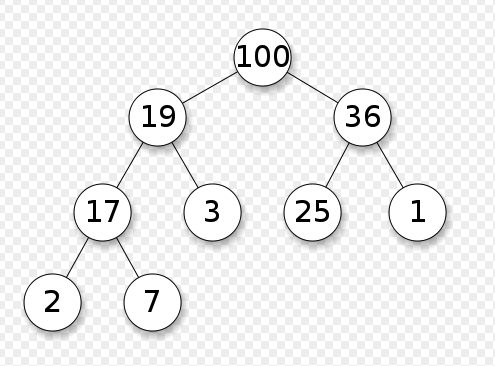

# maxheap
Existing [heapq](https://docs.python.org/3/library/heapq.html) library can be used as a maxheap by negating the values passed.
We need to negate back while retrieving from the heap as well. This can result in 
a cumbersome interface. 

Maxpheap is a implementation similar to heapq that lets you push and pop to the heap.
In a maxheap largest element has the priority.



# Dependencies

Python > 3.6.0

# Install

```sh
pip3 install maxheapq
```

## Verify

```sh
Python 3.8.10 (default, Jun  2 2021, 10:49:15)
[GCC 9.4.0] on linux
Type "help", "copyright", "credits" or "license" for more information.
>>>
>>>
>>> from maxheap import maxheap
```

# Usage

```sh
heap = []            # creates an empty heap
heappush(heap, item) # pushes a new item on the heap
item = heappop(heap) # pops the largest item from the heap
item = heap[0]       # largest item on the heap without popping it
heapify(x)           # transforms list into a max heap, in-place, in linear time
item = heapreplace(heap, item) # pops and returns largest item, and adds
                               # new item; the heap size is unchanged
```
